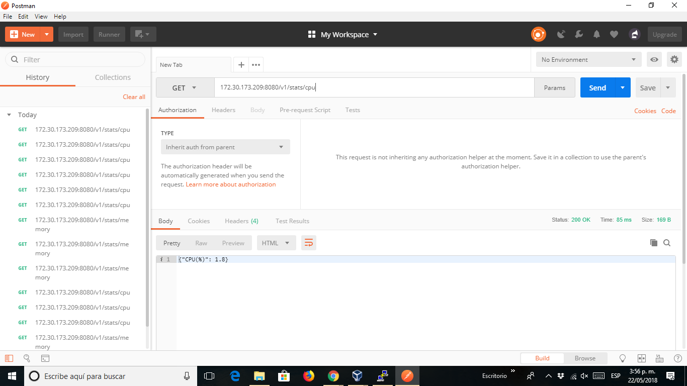
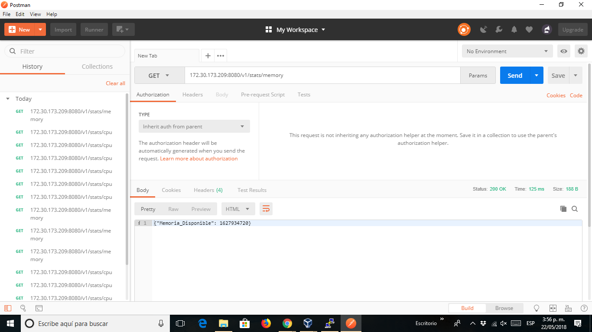
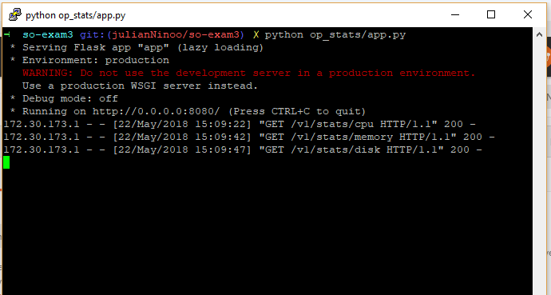
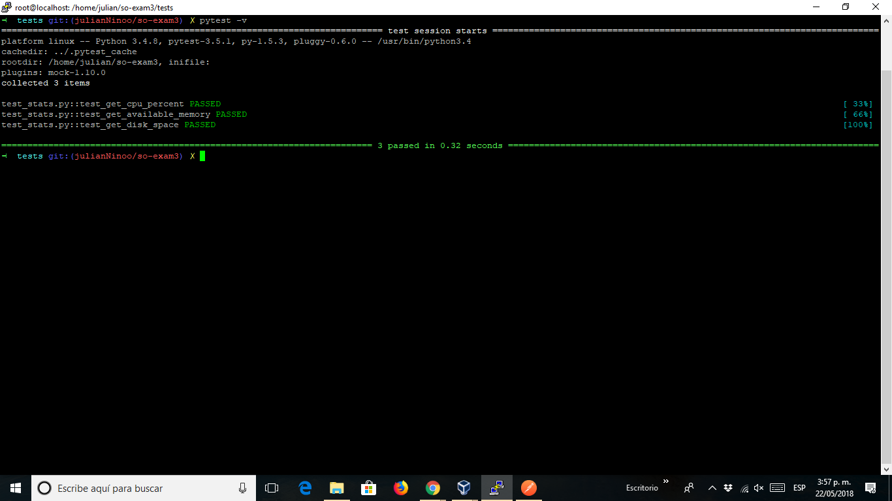
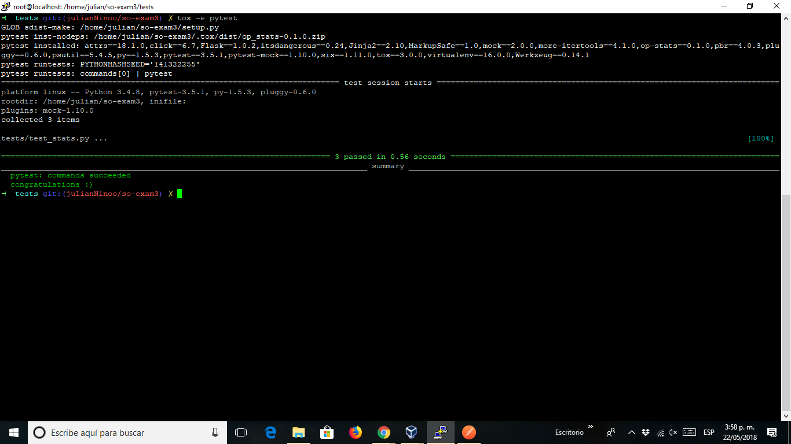

# so-exam3  

**Nombre:** Julián Niño  
**Curso:** Sistemas Operativos  
**Código:** A00328080  
**Correo:** juliannino01@hotmail.com  
**Correo Universitario:** julian.nino@correo.icesi.edu.co  

# PUNTO 3
# Se debe implementar un servicio Web en flask con lo visto en clase 
- Cree un ambiente llamado julian  

-En este ambiente hay unas dependencias llamdas : requirements_dev.txt y requirements.txt, tambien 3 carpetas llamadas op_stats,
scripts y tests  

-En la carpeta llamada op_stats se encuentran dos archivos:  
# En stats.py se encuentra:  

import psutil

class Stats():

  @classmethod  
  def dar_cpu(cls):  
    percent = psutil.cpu_percent()  
    return percent

  @classmethod  
  def dar_memoria(cls):  
    ram_available = psutil.virtual_memory().available  
    return ram_available  

  @classmethod   
  def dar_espacio(cls):  
    free_disk = psutil.disk_usage('/').free  
    return free_disk  

# En app.py se encuentra:  

from flask import Flask
import json
import sys
sys.path.append('/home/julian/so-exam3')
from op_stats.stats import Stats

app = Flask(__name__)

@app.route('/v1/stats/cpu')  
def informacion_cpu():  
    info_cpu = Stats.dar_cpu()  
    return json.dumps({'CPU(%)': info_cpu})  

@app.route('/v1/stats/memory')  
def informacion_memoria():  
    info_memoria = Stats.dar_memoria()  
    return json.dumps({'Memoria_Disponible': info_memoria})  

@app.route('/v1/stats/disk')  
def informacion_disco():  
    info_disco = Stats.dar_espacio()  
    return json.dumps({'Espacio_Disco': info_disco})  
   

if __name__ == '__main__':  
    app.run(host='0.0.0.0',port=8080)  
    
-Se ejecutó  el comando python op_stats/app.py y se hacen las pruebas con postman   

  
 
   
 
   
 
    
  
  # PUNTO 4
  # Se implementa las pruebas unitarias con Fixtures  
  -En la carpeta tests está el archivo test_stats.py   
  
  # En test_stats.py  
  
  import pytest
import sys
sys.path.append('/home/julian/so-exam3')

from op_stats.app import app
from op_stats.stats import Stats

@pytest.fixture
def client():
  client = app.test_client()
  return client

def test_get_cpu_percent(mocker, client):
  mocker.patch.object(Stats, 'dar_cpu', return_value=1)
  response = client.get('/v1/stats/cpu')
  assert response.data.decode('utf-8') == '{"CPU(%)": 1}'
  assert response.status_code == 200

def test_get_available_memory(mocker, client):
  mocker.patch.object(Stats, 'dar_memoria', return_value=2)
  response = client.get('/v1/stats/memory')
  assert response.data.decode('utf-8') == '{"Memoria_Disponible": 2}'
  assert response.status_code == 200

def test_get_disk_space(mocker, client):
  mocker.patch.object(Stats, 'dar_espacio', return_value=3)
  response = client.get('/v1/stats/disk')
  assert response.data.decode('utf-8') == '{"Espacio_Disco": 3}'
  assert response.status_code == 200

- Se ejecuta el siguiente comando:  
 

# PUNTO 5  
# Se emplea un servicio de integración que use las pruebas uniatrias.  
-Se crea el archivo tox.ini  
[tox]
envlist = pytest 

[testenv]
basepython = python3

[testenv:pytest]
deps =
  -rrequirements_dev.txt
commands =
  pytest
   
  -En el archivo .travis.yml está
